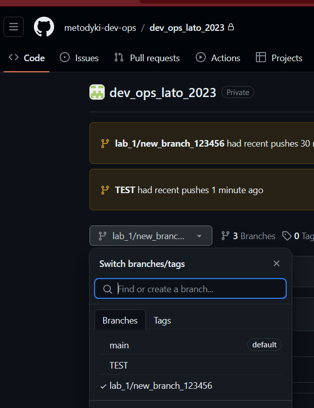
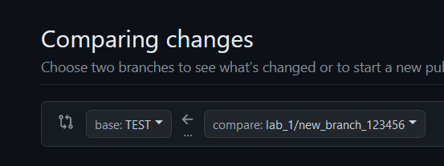
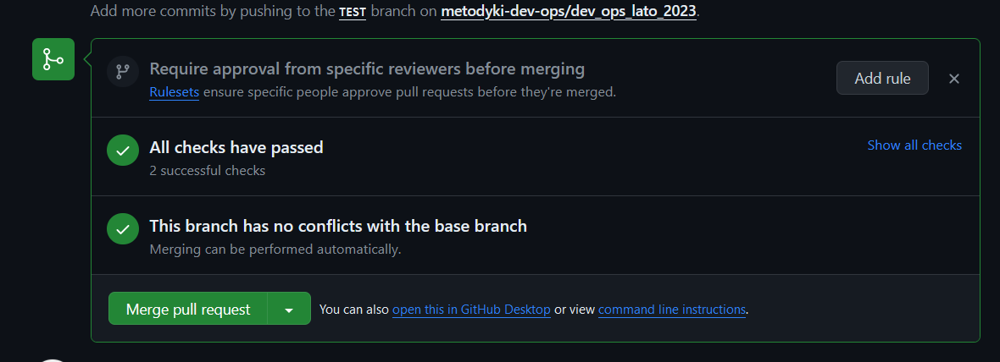

# dev_ops_lato_2026
## ZADANIE 1 GITHUB
      
Cel laboratoriów. 
Celem laboratoriów jest zapoznanie się z podstawowymi komendami gita i używaniem go do tworzenia gałęzi, commitów, wypychania zmian (push) i tworzenia pull requestów.

Aby zaliczyć laboratoria należy wykonać następujące kroki.
### 1 Dodać klucz SSH do konta GitHub
- 1.1 Wygenerować klucz SSH na swoim komputerze: https://docs.github.com/en/authentication/connecting-to-github-with-ssh
- 1.2 Dodać klucz SSH do swojego konta: https://github.com/settings/keys

### 2 Pobranie repo 
- 2.1 Ściągnąć repozytorium za pomocą komendy `git clone` (jeżeli nie zadziała, klucz SSH jest źle skonfigurowany).

```bash
git clone git@github.com:Tomzonkal/DevOps2026.git
```
### 3 Stworzenie gałęzi roboczej 
- 3.1 W celu stworzenia gałęzi w lokalnym repozytorium należy wykonać komendę `git switch -c nazwa_gałęzi`. Aby uniknąć konfliktów, należy nazwać gałąź **lab_1/new_branch_nrIndeksu**.

 ```bash
git switch -c lab_1/new_branch_123456
```
    
### 4 Edycja kodu
- 4.1 Upewnij się, że pracujesz w nowo utworzonej gałęzi za pomocą komendy `git branch` (nazwa brancha z gwiazdką to aktualny branch).
 ```bash
git branch
```
- 4.2 Skopiować folder `model_0000` do tego samego katalogu `Lab_1` i zmienić nazwę na `model_nrIndeksu`, np. `model_123456`.
- 4.3 W pliku **config.py** dodać nr indeksu na końcu do listy `id_list` jako string (nr indeksu musi znaleźć się pomiędzy nawiasami `[]`).
- 4.4 W nowo utworzonym folderze (folder z naszym nr indeksu) zmienić nazwę funkcji `run_model_0000` na `run_model_naszNrIndeksu`, w naszym przypadku będzie to `run_model_123456`.
- 4.5 Zaimportować nasz kod w pliku **app.py**. Należy dodać na  początku pliku  linijkę

``` python
from model_nrNaszegoIndeksu import model as model_nrNaszegoIndeksu
```

- 4.6 Należy skopiować w pliku **app.py** całą definicję funkcji `model_00000_input` wraz z dekoratorem (linijka powyżej `@app.route ...`). Następnie należy wkleić ją poniżej tej funkcji i zmienić jej nazwę na `model_nrNaszegoIndeksu_input`.

**Zwrócić uwagę, czy zgadzają się odstępy i czy cały kod został poprawnie skopiowany i wklejony wraz z dekoratorem.**

- 4.7 Następnie należy zmienić kod stringa w dekoratorze z **'/api/model_0000'** na **'/api/model_nrNaszegoIndeksu'**
- 4.8 Należy w definicji kodu zmienić nazwę funkcji na naszą tj. podmiana linijki **result=model_0000.run_model_0000(input=input)** na **result=model_nrNaszegoIndeksu.run_model_nrNaszegoIndeksu(input=input)**

### 5 Dodawanie zmian do repozytorium lokalnego i wypychanie na repozytorium zdalne 
- 5.1 Aby dodać zmiany do commita należy użyć komendy `git add` ścieżka_do_pliku (jeżeli chcemy uwzględnić wszystkie zmiany bez wypisywania wszystkich plików, można użyć symbolu `*`).

``` bash
git add *
```
- 5.2 Tworzymy commit z wprowadzonymi zmianami.

 TIP. Commit powinien obejmować małe zmiany, a nie wdrożenie całego rozwiązania gdyż łatwiej naprawić błędy. 

 Do stworzenia commita niezbędne jest skonfigurowanie maila jak i nazwy użytkownika jeżeli wcześniej nie zostało to zrobione. W tym celu należy uruchomić instrukcje:
``` bash
git config --global user.email "your_email@example.com"

git config --global user.name "User_name"
```

Aby stworzyć commita musimy podać jego nazwę, która opisze wprowadzone zmiany. W tym celu korzystamy z komendy:

``` bash
git commit -m "nasza zmiana np. - dodano model dla użytkownika 123456"
```
- 5.3 Wypychamy commit za pomocą komendy:

``` bash
git push 
```

Może się pojawić informacja, by użyć opcji ze wskazaniem brancha po nazwie, w naszym przypadku będzie to:
``` bash
git push --set-upstream origin lab_1/new_branch_123456
```
Zazwyczaj konsola tworzy komendę gotową do skopiowania i użycia 

### 6 Weryfikacja commitu i tworzenie pull requesta

- 6.1 Aby zweryfikować czy kod jest już na zdalnym repozytorium należy przejść na stronę repo `https://github.com/metodyki-dev-ops/dev_ops_lato_2026/tree/main`, a następnie zmienić gałąź `main` na naszą. Jeżeli widzimy zmiany w przeglądarce oznacza to, iż kod został wykonany poprawnie.



- 6.2 Wchodzimy w zakładkę Pull requests i tworzymy pull request, który połączy naszą gałąź z gałęzią TEST.

UWAGA: zwrócić uwagę, czy BASE to jest TEST, a compare to nasza gałąź.



- 6.3 Jeżeli testy przeszły zadanie zostało wykonane prawidłowo 



### 7 Sprawozdanie 

- 7.1 Sprawozdanie ma być dokumentacją pracy tj. opisem wykonanych kroków wraz ze zdjęciami i opisem wykorzystywanych metod. Ma ono pozwolić na odtworzenie zadania z wykorzystaniem instrukcji ze sprawozdania.
- 7.2 Ma być ono zapisane za pomocą Markdowna w skopiowanym folderze.


### Zaliczenie laboratoriów 
- Sprawozdanie w docelowej lokalizacji 
- Gotowa do oddania praca i sprawozdanie w postaci pull requesta (można dodać commita do brancha z już utworzonym pull requestem, aby dodać sprawozdanie)
- Wszelkie edycje skryptów testowych i automatyzujących workflow są zabronione (czyli plików niewymienionych w instrukcji)
- Pushe mają być wykonywane WYŁĄCZNIE Z NASZYCH KONT GITHUB 

### Tematy do rozwinięcia w sprawozdaniu w celu podniesienia oceny z sprawozdania 

Ocena jest podwyższona o ile wcześniejsze kroki instrukcji zostały wykonane, nie ma możliwości zaliczenia laboratoriów samym tematem dodatkowym.

Tematy te proszę zamieścić w osobnym rozdziale

- Czym się różni `git fetch` od `git pull`
- Różnica między local repository a remote repository
- Czym się różni gitflow od GitHub flow
- Czemu używa się release branchy
