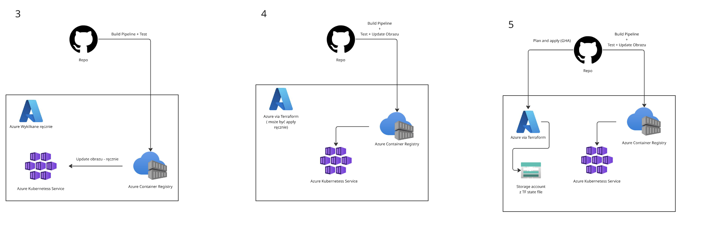

# Projekt — DevOps 2026

## Opis

Projekt  polega na zbudowaniu potoku CI/CD dla aplikacji kontenerowej wdrażanej na Azure Kubernetes Service. Zakres wymagań zależy od oceny, na którą student się decyduje — każdy kolejny poziom rozszerza poprzedni o dodatkowe elementy automatyzacji i dojrzałości DevOps.

Szczegółowe wymagania dla każdego poziomu opisane są w osobnych plikach:

| Ocena | Plik | Opis |
|-------|------|------|
| **3** | [LAB-03-podstawowy-cicd.md](LAB-03-podstawowy-cicd.md) | Podstawowy pipeline CI/CD — automatyczny build i push obrazu; infrastruktura i deployment ręczne |
| **4** | [LAB-04-terraform-auto-deploy.md](LAB-04-terraform-auto-deploy.md) | Infrastruktura jako kod (Terraform) + automatyczny deployment obrazu w AKS po każdym commicie |
| **5** | [LAB-05-gitops-remote-state.md](LAB-05-gitops-remote-state.md) | Pełny GitOps — Terraform plan/apply przez GHA, remote state w Azure Storage, autoryzacja przez OIDC |

---

## Przegląd architektur

Poniższy diagram przedstawia różnicę między wymaganymi architekturami dla poszczególnych ocen:

- **Ocena 3** — GitHub Actions buduje i testuje obraz, ale infrastruktura Azure (ACR, AKS) tworzona jest ręcznie, a aktualizacja obrazu w klastrze również wymaga ręcznej interwencji.
- **Ocena 4** — Infrastruktura opisana w Terraform (może być aplikowana ręcznie lub przez CI). Pipeline automatycznie buduje, testuje, publikuje obraz do ACR i aktualizuje deployment w AKS.
- **Ocena 5** — Pełna automatyzacja: Terraform plan wykonywany na każdym PR jako komentarz, apply po merge do `main`, state przechowywany zdalnie w Azure Storage Account, autoryzacja przez Workload Identity Federation (OIDC) bez długożyciowych sekretów.

---

